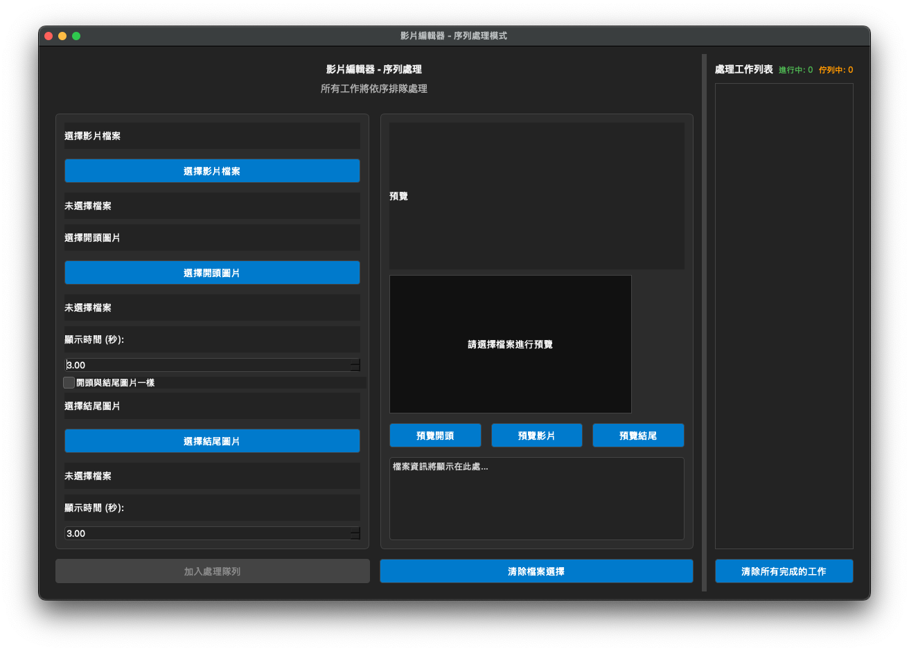

# 影片編輯器 (Video Wrapper)

一個簡單易用的桌面應用程式，可以為您的影片快速添加靜態的開頭和結尾圖片。採用序列佇列處理模式，穩定可靠。



---

## ✨ 主要功能

- **序列處理**: 所有任務都會進入佇列依序處理，確保系統穩定，避免資源競爭導致的崩潰。
- **簡單易用**: 直觀的圖形化介面，輕鬆選擇影片和圖片。
- **預覽功能**: 在處理前可以預覽開頭、結尾圖片和影片的第一幀。
- **彈性選項**:
  - 可只加開頭、只加結尾，或兩者都加。
  - 可設定開頭/結尾圖片的顯示時長。
  - 提供「開頭與結尾圖片一樣」的便利選項。
- **深色主題**: 現代化的深色 UI。
- **跨平台**: 使用 PyQt6 和 Python，理論上可在多平台運行 (主要在 macOS 上開發與測試)。

## 🛠️ 環境需求

- macOS 12 以上（Apple Silicon/arm64）
- Python 3.10+（僅在開發/打包機器上需要）
- 不需要使用者安裝系統 FFmpeg（我們會內嵌）

## 🚀 開發模式執行

```bash
# 建議使用虛擬環境
./setup.sh
source venv/bin/activate

# 執行
python video_wrapper2.py
```

## 📦 打包為可獨立運作的 macOS .app

我們提供了新的打包流程（v2）：

1. 準備內嵌 FFmpeg/FFprobe（arm64）
   - 將已編譯好的 ffmpeg/ffprobe 放到：
     - `assets/bin/mac/arm64/ffmpeg`
     - `assets/bin/mac/arm64/ffprobe`
   - 並確保具有執行權限：
     ```bash
     chmod +x assets/bin/mac/arm64/ffmpeg assets/bin/mac/arm64/ffprobe
     ```

2. 建立 .app
   ```bash
   source venv/bin/activate
   ./build_v2.sh
   ```
   - 完成後，輸出位於：`dist/影片編輯器.app`

3. 若 macOS 阻擋啟動（未公證），可移除檔案檢疫屬性：
   ```bash
   xattr -cr /path/to/dist/影片編輯器.app
   ```

### v2 流程重點
- 程式在啟動時會優先尋找內嵌的 `assets/bin/mac/arm64/{ffmpeg,ffprobe}`；找不到才回退到系統路徑。
- `.spec` 檔已收打包 `assets/` 目錄（包含圖示與內嵌 ffmpeg/ffprobe）。
- 提供 `build_v2.sh` 腳本自動完成清理與打包。

## 🔧 疑難排解

- 啟動失敗顯示缺少 Qt 平台外掛：請確認 `build_v2.sh` 由 `.spec` 打包的 `.app`，不要直接拷貝未完整的建置輸出。
- 無法呼叫 ffmpeg：請確認 `assets/bin/mac/arm64/ffmpeg` 與 `ffprobe` 存在且有執行權限。
- Gatekeeper 提示「檔案已毀損」：請執行 `xattr -cr`（如上）。

## 📄 授權與第三方元件

- 專案本身採用 [MIT 授權](LICENSE)。
- 若內嵌 FFmpeg，請遵守其授權（LGPL/GPL）並於內部散佈時保留相應授權與來源資訊。

## 🙌 貢獻

歡迎任何形式的貢獻！如果您有好的想法或發現了問題，請開 Issue 或提交 Pull Request。 